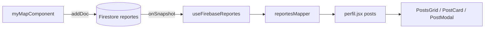

# Integración mapa → perfil

**Fecha:** 2026-06-04 09:38 CST  
**Solicitud:** Mostrar en `/perfil` los reportes creados en `myMapComponent`, con nombre, imagen, tipo de residuo, cantidad y nivel de riesgo.

## Resumen

Ambas pantallas comparten la colección Firestore **`reportes`**. El mapa escribe con `addDoc`; el perfil escucha con `onSnapshot` y convierte cada documento en una tarjeta de publicación.

## Archivos nuevos

| Archivo | Rol |
|---------|-----|
| `src/lib/reportesMapper.js` | Convierte documentos Firestore → objeto `post` del perfil; calcula `analyzeReport` (AgenteCora). |
| `src/hooks/useFirebaseReportes.js` | Suscripción en tiempo real a `reportes`. |
| `docs/map-perfil-integration.md` | Este documento. |

## Archivos modificados

| Archivo | Cambio |
|---------|--------|
| `src/pages/perfil.jsx` | Elimina mock posts; combina `mapPosts` (Firebase) + `localPosts` (admin manual). |
| `src/components/perfil-components/postsGrid.jsx` | Estado de carga; reportes del mapa no se editan/eliminan/verifican desde la UI. |
| `src/components/perfil-components/postcard.jsx` | Muestra reporter, meta (tipo, cantidad, riesgo), badge AgenteCora. |
| `src/components/perfil-components/postModal.jsx` | Vista detallada con campos del mapa y análisis AgenteCora. |
| `src/styles/perfil.css` | Estilos para reporter, meta y modal de reportes. |

## Campos mostrados en perfil

| Campo usuario | Origen Firestore / mapa |
|---------------|-------------------------|
| Nombre | `reportado_por` → `post.name` |
| Imagen | `picture` / `image_url` (pool `basura1–3`, mismo criterio que Archivero) |
| Tipo residuo | `tipo_residuo` → `post.wasteType` |
| Cantidad | `cantidad` → `post.amount` |
| Riesgo declarado | `riesgo_contaminacion` → `post.riskLevel` |
| AgenteCora | `post.analysis` desde `analyzeReport(marker)` |

## Flujo de datos

## Scroll en /perfil (2026-06-04)

- `MapaHome.css` ya no aplica `overflow: hidden` a `html`/`body`/`#root` (solo al contenedor `.app` del mapa).
- `perfil.css` habilita scroll con `:has(.profile-page-wrapper)` y padding inferior extra.
- `perfil.jsx` restaura `overflow: auto` en `body` al montar la página.

## Notas

- Los posts creados con **+ New Post** (admin) siguen siendo solo locales (`localPosts`).
- No se modificó `myMapComponent.jsx`: ya persistía todos los campos necesarios.
- Para probar: crear un reporte en el mapa → abrir Perfil → debe aparecer sin recargar la página.
